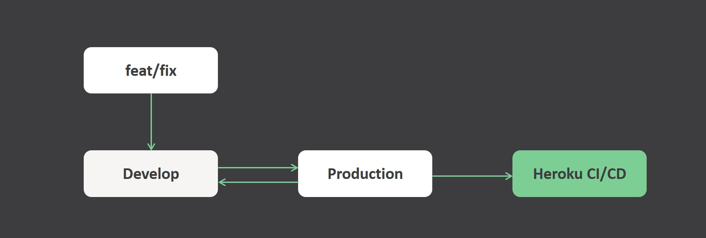
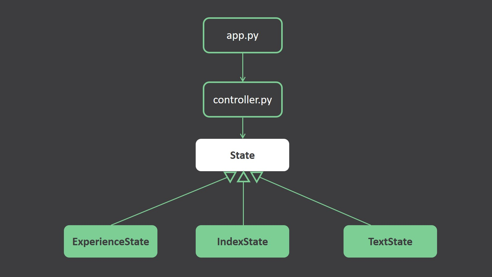
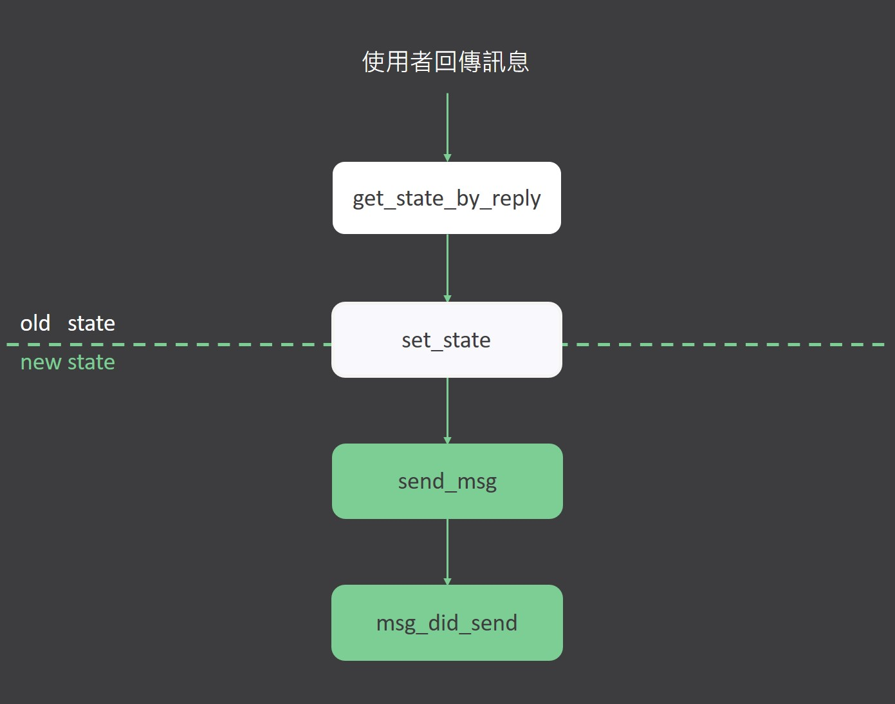

# LINE internship pre-assessment
## 加入此 LINE BOT 好友
@025zvtbe


## Install
環境請參考Pipfile，並將 `.env.sample`複製、重新命名為 `.env` 後填入對應資訊。
```bash
pip install pipenv
pipenv install
```
## 執行
```
python3 app.py
```
## GitFlow
此專案在開發時依循簡單的Gitflow。並整合CICD，當push到production時會自動部屬到Heroku:



## Program UML chart
此程式是在**state pattern**的概念下開發。在收到使用者回傳的訊息時，controller會固定呼叫抽象化的state method來決定要回傳什麼訊息。



整體程式結構是finite state machine，不過state之間的關係相對簡單，操作機器人後就能理解。

## State lifeCycle
每個state會根據收到的訊息，決定下一個state要是誰，並注入至controller。在傳回訊息後，也能透過 `msg_did_send()`去做特殊操作。

舉例而言，因為textState無法回傳給使用者操作的按鈕，所以「textState傳完訊息後，會先等待兩秒，再主動切換回先前的state，並把該state的訊息主動傳回給使用者。」這就是用`msg_did_send()`去達成的。

